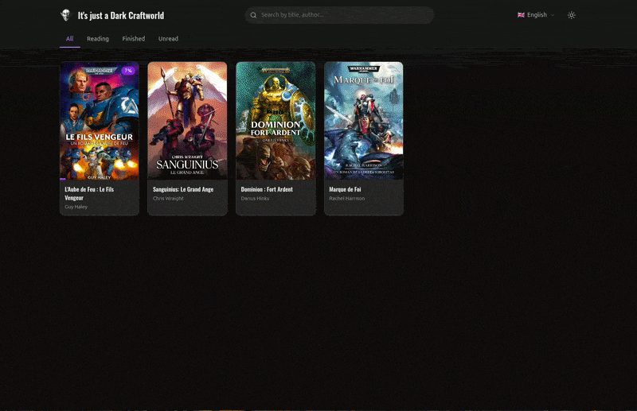

# Dark Craftworld



A Black Library ebook reader/downloader in the browser. Displays the ebooks you legitimately purchased and therefore should be able to read on whatever device you want. It lets you read EPUBs directly, with reading progress tracked in localStorage.

## Why?

Games Workshop is sunsetting the [Black Library website](https://www.blacklibrary.com/). Whatever you think of it (outdated, crappy, you name it), it had one genuinely great quality: **you were buying DRM-free EPUB files**. That's a rare and incredibly user-friendly thing in a world dominated by locked ecosystems like Kindle.

Their replacement is a mobile-only app. No desktop support, no way to download the `.epub` files you paid for. What about reading on my old Kobo? Or on my PC when I feel like it? The app is simply not a satisfying alternative to me, most notably because it lacks the best selling point the old website had compared to Rakuten Kobo or Amazon Kindle.

So here is a half-assed project mostly vibe-coded in a few hours because I quickly saw that the brand new API was still serving my beloved DRM-free files. It is absolutely not meant to be put online. I just figured I could put it out there for hobbyists like me who would like to keep reading the books they legitimately bought, in the way they want, on whatever device they want. And maybe to show Games Workshop that a proper alternative to the soon-defunct website would not be that hard and should let us download our EPUB files.

## Prerequisites

- Node.js 24+
- A My Warhammer account with purchases on the Black Library app.

## Getting authentication tokens

The Black Library API uses Auth0 with a PKCE flow. The mobile app authenticates via a custom URI scheme (`com.gamesworkshop.bl://`) — after you log in on the web, Auth0 redirects to that scheme, which normally opens the app. The setup scripts below register a handler on your OS to intercept that redirect instead, capture the authorization code, and exchange it for API tokens. Essentially, we're pretending to be the app just long enough to get the keys.

### Linux

Open a terminal in the project directory and run:

```bash
./setup-auth-linux.sh
```

This registers a handler for the `com.gamesworkshop.bl://` custom URI scheme, opens your browser to log in, and writes the tokens to `.env`.

### Windows

Thanks to [CRRaphael](https://github.com/CRRaphael) for testing (and fixing) the Windows setup script!

Open Command Prompt in the project directory and run:

```bat
setup-auth-windows.bat
```

This registers the URI scheme in the Windows registry, opens your browser to log in, and writes the tokens to `.env`.

### Manual / re-auth

If you've already set up the URI handler and just need to refresh tokens:

```bash
npm run auth
```

The tokens are written directly to your `.env` file (created if missing, updated if it exists).

## Installation and running

```bash
npm install
npm run dev
```

⚠️ **Notice for Windows users:** I have updated the dependencies, so things should work as expected on Windows, HOWEVER people reported they had to use `npm install --force` on Windows specifically. I am still investigating on that.


The app is available at http://localhost:5173

If you want to expose it on your local network (e.g. to read on your phone or Kobo):

```bash
npm run dev:host
```

## Production

```bash
npm run build
npm start
```

The Express server serves the built app and proxies API calls. It also handles automatic token refresh when the token expires.

## Structure

```
src/
  views/
    LibraryView.vue    # Purchased ebooks grid
    ReaderView.vue     # EPUB reader (epub.js)
  composables/
    useLibrary.js      # Fetch purchases
    useProgress.js     # localStorage progress tracking
  services/
    api.js             # Proxied API calls
    epubCache.js       # IndexedDB EPUB cache (LRU, 50MB)
  components/
    BookCard.vue       # Book card in the grid
    DialogDrawer.vue   # Drawer (mobile) / Dialog (desktop)
    FancyBackground.vue # Dot pattern background
    Dropdown.vue       # Animated dropdown menu
server/
  index.js             # Express + proxy for production
  auth.js              # Auth0 token management + refresh
auth.mjs                 # Auth flow (Node.js, PKCE + token exchange)
setup-auth-linux.sh      # Linux: register URI handler + run auth
setup-auth-windows.bat   # Windows: register URI handler + run auth
```

## Known API endpoints

| Endpoint | Description |
|---|---|
| `/purchases/` | Purchased ebooks |
| `/ebooks/new` | New ebooks |
| `/ebooks/featured` | Featured ebooks |
| `/ebooks/offers` | Deals / promotions |
| `/audiobooks/new` | New audiobooks |
| `/titles/{id}` | Title details |
| `/series/{id}` | Series details |
| `/universes/` | Universe list |
| `/previews/{id}` | Preview / download |

## Technical notes

- The API requires the header `User-Agent: okhttp/4.12.0` (otherwise Cloudflare blocks with a 403/1010)
- The Auth0 audience is `https://blacklibrary.com/app` (not the API URL)
- Tokens were extracted by decompiling the Android APK with `apktool`
- Auth0 client_id is `9ZzNoBg7wu9YSAQg3oohp24RICm35iD6`, domain `login.mywarhammer.com`
